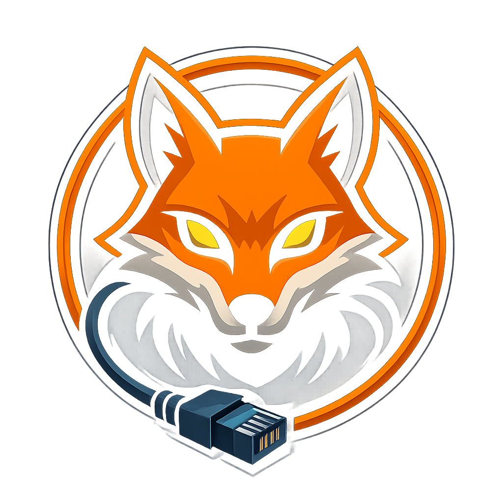
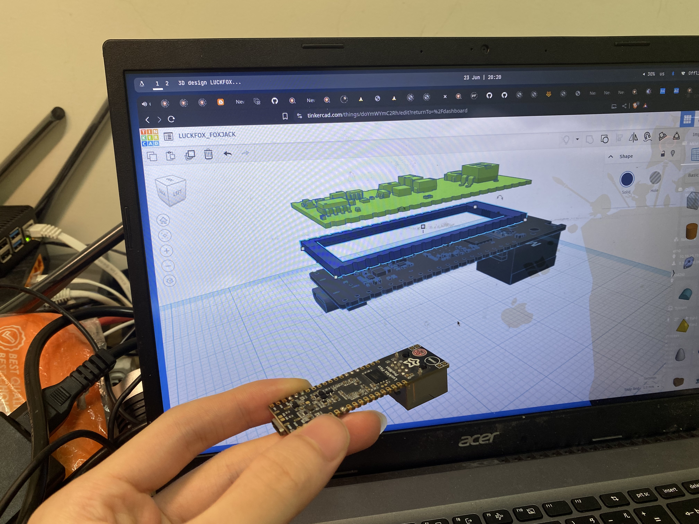
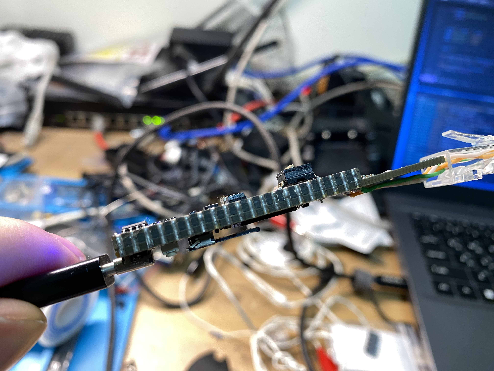
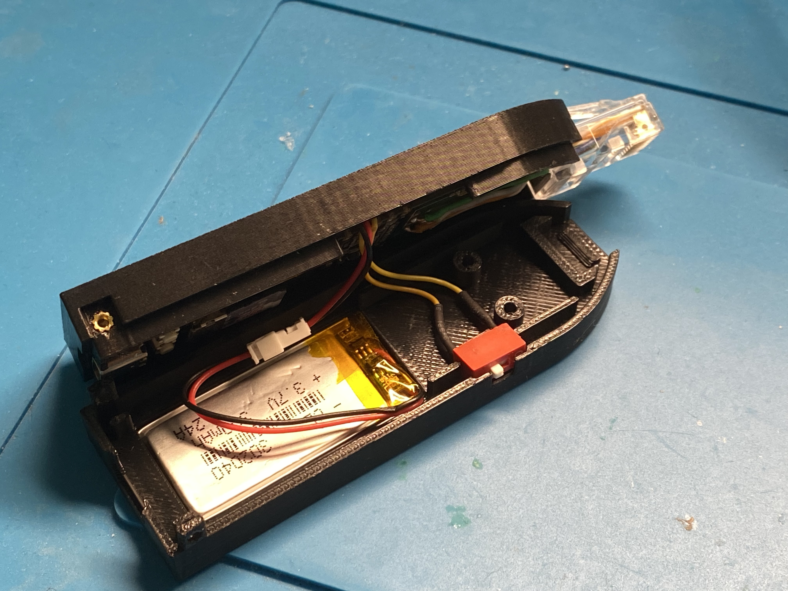
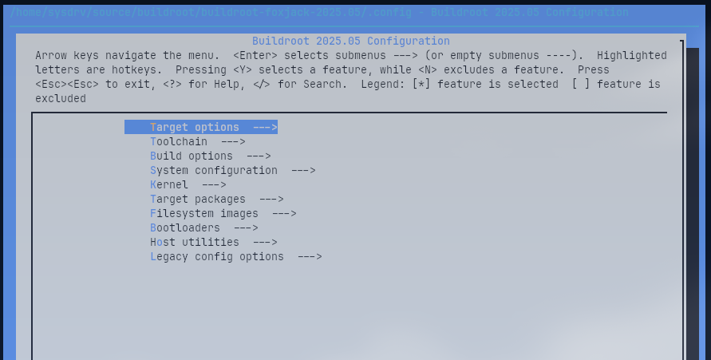
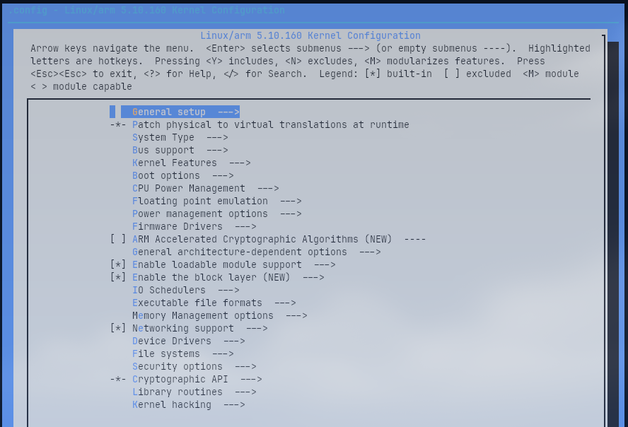
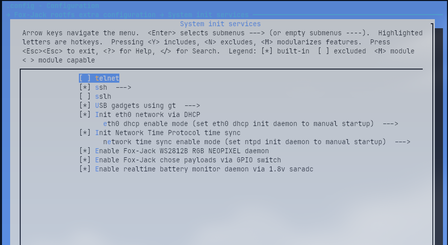
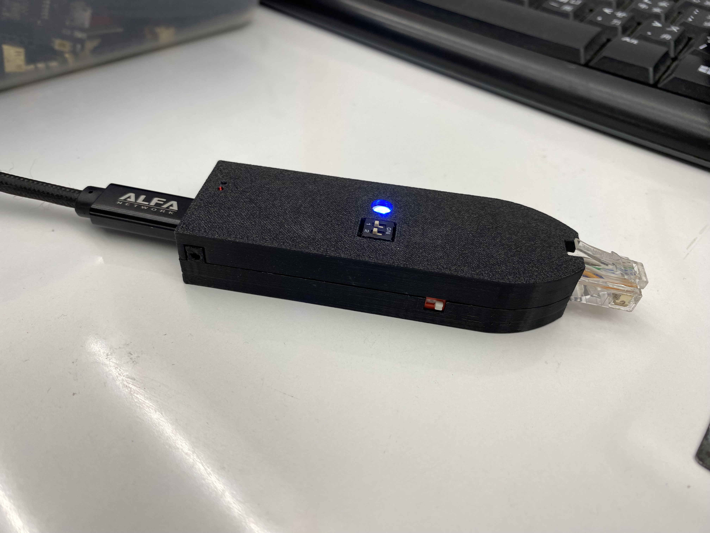
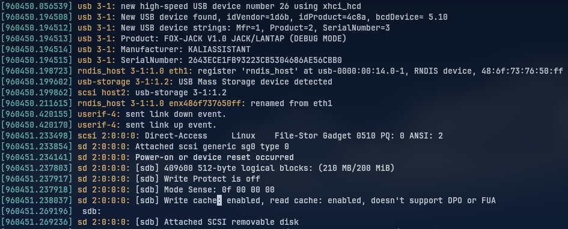

# Fox-Jack
> Portable social-engineering LAN tool for automated payloads and wired audits — based on Luckfox Pico Max

## About

**Fox-Jack** is a low-cost, DIY social engineering LAN implant inspired by the Hak5 SharkJack.  
Designed for payload delivery, opportunistic wired auditing, and SE engagements, it features DIP-switch mode control, RGB LED feedback, and USB gadget interfaces — all powered by the **Luckfox Pico Max (RV1106G3)**.

### Features

* USB gadget function: **RNDIS** over USB
* 100 Mbps onboard **GMAC** Ethernet
* Based on **Luckfox Pico Max (RV1106G3)**
* Optional **open-source extension board PCB**:

  * 300mAh LiPo battery support (\~1–2hr uptime, longer with bigger battery)
  * **NeoPixel RGB LED** status indicator
  * **2-position DIP switch** to select payloads
* Optional **3D printable cases**
* Rootfs: **Buildroot**
* Boot: **SD card**
* U-Boot: **Luckfox official SDK**

---

## Repository Contents

* 🧰 **Luckfox Pico Official SDK**
* 🔨 **Image build scripts**
* 🧱 **3D-printable case designs**
* 🗒 **Optional extension board**:

  * KiCad project
  * Gerber files
  * BOM

---

## Parts List

| Item                                       | Qty | Link |
| ------------------------------------------ | --- | ---- |
| Luckfox Pico MAX (256 MB RAM version only) | 1   | [Amazon](https://a.co/d/7qTUaEF) |
| M2x0.4 Heat-Set Thread Insert (D3×H2.5)    | 2   | [Amazon](https://a.co/d/6mJeA5C) |
| M2x0.4 Heat-Set Thread Insert (D3×H2)      | 2   | [Amazon](https://a.co/d/6mJeA5C) |
| M2x0.4 Ultra-Low Head Torx Screws (3mm)    | 2   | [Amazon](https://a.co/d/fiHYJ7t) |
| M2x0.4 Hex Socket Head Cap Screws (10mm)   | 2   | [Amazon](https://a.co/d/4TCJOGo) |
| DIP Switch 1 Positions                     | 1   | [Amazon](https://a.co/d/8rEHPwg) |
| 302040 Lipo 3.7v battery                   | 1   | [Amazon](https://a.co/d/8rEHPwg) |

> [!NOTE]
> 🔧 PCB & BOM: all files in the `pcb/` directory

---

## Required Tools

* 28 AWG electrical wire
* Soldering tools:

  * Solder
  * Solder iron
  * Solder paste
  * Solder flux
  * Hot air gun (for SMD components on extension board)

---

## Fox-Jack EXT Board

#### Assembly Notes: [README](./pcb/README.md)




---

## 3D printable cases

#### see: [README](./3dp/README.md)




---

## Build Instructions

1. Create a Debian/Ubuntu/Kali (or other Debian-based) Linux environment
   *(You can use a VM or physical machine — author uses a Debian laptop)*

2. Install required dependencies:

   ```bash
   sudo ./dep.sh
   sudo apt update
   sudo apt install -y docker.io kconfig-frontends make cmake automake autoconf libtool libtool-bin rsync
   ```
   
3. Clone the repository:

   ```bash
   git clone https://github.com/KaliAssistant/Fox-Jack.git
   ```

4. Navigate into the repo:

   ```bash
   cd Fox-Jack
   ```

5. Run the build script:

   ```bash
   sudo ./build.sh all
   ```

   You will see the SDK's *lunch menu*:

   ```
   You're building on Linux
   Lunch menu...pick the Luckfox Pico hardware version:
   [4] RV1106_Luckfox_Pico_Pro_Max
   ...
   Which would you like? [default: 0]: 4

   Lunch menu...pick the boot medium:
   [0] SD_CARD
   Which would you like? [default: 0]: 0

   Lunch menu...pick the system version:
   [0] Buildroot
   Which would you like? [default: 0]: 0
   ```

> [!NOTE]
> ✅ Just enter `4 / 0 / 0` — **only Luckfox Pico Max** is supported currently.

---

## Config Options

You can tweak build options using the following:

* **Buildroot menuconfig**:

  ```bash
  sudo ./build.sh luckfox buildrootconfig
  ```
  

* **Kernel menuconfig**:

  ```bash
  sudo ./build.sh luckfox kernelconfig
  ```
  

* **Foxjack extra config (e.g., SSH key, services)**:

  ```bash
  sudo ./build.sh foxjackconfig
  ```
  

> [!NOTE]
> **Security Note:**
> Default root password is `foxjack`, but **SSH password login is disabled** (`PermitRootLogin prohibit-password`) for security.
> Add your public key via `foxjackconfig`.
> If you need password login, modify `/etc/ssh/sshd_config` in rootfs manually.

To access via **USB RNDIS**, make sure your host PC has a static IP in the same subnet as defined in `foxjackconfig`.

---

## Flashing to SD Card

Once the build is complete, flash the image:

```bash
sudo ./build.sh sdflash
```

You'll see:

```
WARNING: Check the SD card dev path! blkenvflash can overwrite your system drives!
Enter your SD card dev path (/dev/sxx)... >
```

> [!WARNING]
> **Be careful!** Enter the correct SD card device path to avoid overwriting your OS drive.

---

## Run Modes (Payload Selection)

Fox-Jack supports 4 modes, selected via a 2-position DIP switch:

| Mode      | SW1 | SW2 | Description    |
| --------- | --- | --- | -------------- |
| 0 (debug) | 0   | 0   | Dev/debug mode |
| 1         | 1   | 0   | Payload 1      |
| 2         | 0   | 1   | Payload 2      |
| 3         | 1   | 1   | Payload 3      |

Read via GPIO:

```c
#define SW1_PIN 67  // gpio2_a3_d (pin 27)
#define SW2_PIN 66  // gpio2_a2_d (pin 26)
```

---

### Debug Mode Details

In **debug mode** (SW1=0, SW2=0):

* USB gadget provides **RNDIS Ethernet** **+ Mass Storage**
* Payloads can be edited directly from host PC
* **LOOT** (results, passwords, hashes) is saved in:

  ```
  <UMS>/loot/
  ```




---

## Payload Examples

#### see [README](./payload_examples/README.md)

Payload filenames must follow this format:

```
E????-name.payload
```

* `E????` is a 4-digit payload ID (e.g., `E0000`)
* `name` is a short, descriptive label

**Example:**

```
E0000-arp-scan.payload
```


---

## Disclaimer

**Fox-Jack** is intended for authorized security testing, educational, and research purposes only.  
Use of this device without explicit permission on networks or systems you do not own or have authorization to test is illegal and unethical.  
The author and contributors are not responsible for any misuse or damage caused by this tool.  
Please ensure you comply with all applicable laws and obtain proper consent before deployment.

---

## License

Fox-Jack is open-source and released under the **GNU General Public License v3.0 (GPLv3)**.
You are free to use, modify, and redistribute under the terms of this license.

See the [`LICENSE`](./LICENSE) file for full details.

