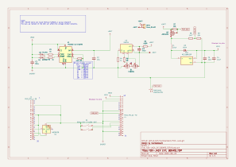
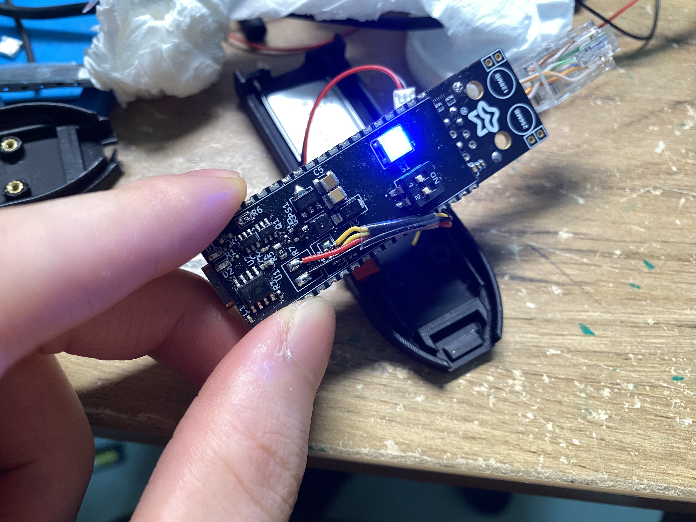
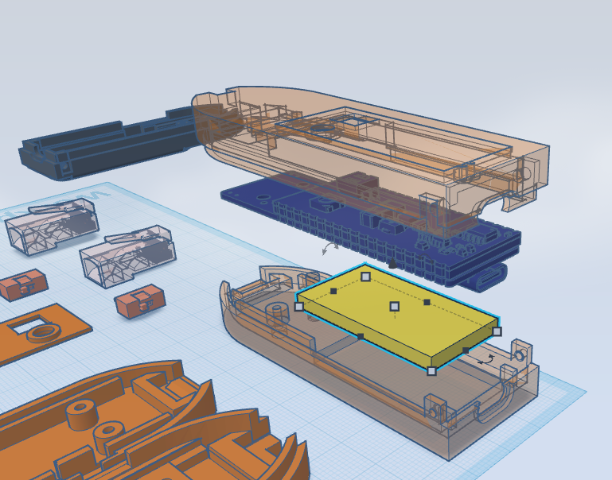
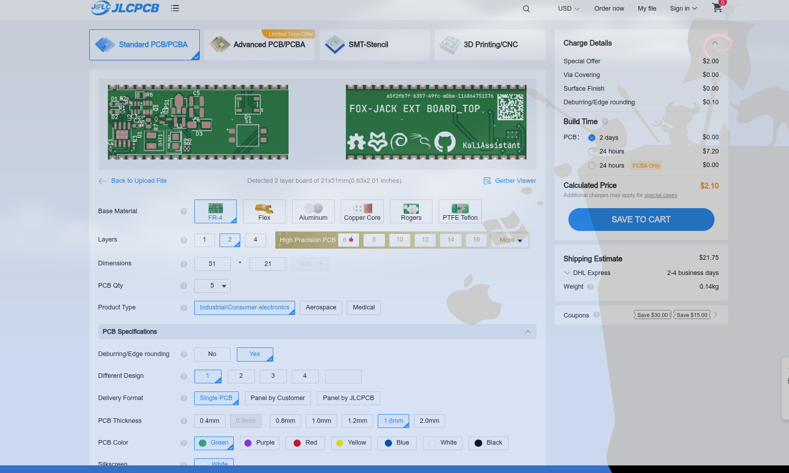

# FOX-JACK\_EXT\_BOARD

This directory contains the open-source **extension board** for the [Fox-Jack](https://github.com/KaliAssistant/Fox-Jack) project.

Designed with a **stacked PCB layout** inspired by modular smartphones (like iPhones), the board achieves a **compact**, **robust**, and **DIY-friendly** assembly with the **Luckfox Pico Max**.

---

## Board Structure

The extension board is made up of **two stacked PCBs**:

### 1. `FOX-JACK_EXT_BOARD_TOP`

* Primary functional PCB
* PCB thickness: **0.8mm**
* Hosts core components: battery management, WS2812 (NeoPixel), DIP switch, etc.

### 2. `FOX-JACK_EXT_BOARD_MID`

* Acts as a **mechanical connector** and **base shim**
* PCB thickness: **1.6mm**
* Designed to fit perfectly between the `TOP` board and the **Luckfox Pico Max**
* Provides mechanical rigidity and solder alignment

> [!NOTE]
>  This stacked layout allows professional-looking compact integration at minimal cost and effort.

---

## Assembly Notes

> [!NOTE]
> Soldering requires careful thermal profiling!

* **Top Board (`TOP`)**

  * Use **high-temperature solder paste** (e.g., Sn63/Pb37 or SAC305)

* **Mid Board (`MID`)**

  * Use **low-temperature solder paste** (e.g., Sn42/Bi58) for the mechanical + electrical bridge with the Pico board
  * Helps avoid reflowing the `TOP` board during final reflow

---

## Battery Info

* Recommended: **Li-ion 3.7V 300mAh**
* Model: **302040**
* Chosen to fit snugly inside the 3D-printed case in this repo

---

## ADC Voltage Measurement

If you want to **read battery voltage** using the **Pico’s ADC**:

* Remove **R57** on the **Luckfox Pico Max PCB**
* (R57 is a **10K ±5% pull-up** resistor that affects accurate voltage reading)
* See https://github.com/LuckfoxTECH/luckfox-pico/issues/174

---

## Compatibility with 3D-Printed Case

To fit the extension + Pico board into the provided **3D-printed case**, perform the following hardware mods:

1. **Remove** the following components from the Pico:

   * **RJ45 Ethernet socket**
   * **CSI Camera connector**
   * **RTC battery holder**

2. **Modify Ethernet Cable**:

   * Cut and strip a short **4P (or 8P)** RJ45 cable
   * Remove filler and outer jacket
   * Solder directly to the Pico’s Ethernet pads
   * 4P is enough for **100 Mbps** **(rv1106g3 gmac only support 100Mbps phy)**

---

## Files Included

* ✅ KiCad project files (`.kicad_pcb`, `.sch`, etc.)
* ✅ Gerber + drill files (for fabrication)
* ✅ BOM (Bill of Materials)
* ✅ Assembly guidelines
* ✅ 3D models and printable case (`.stl`, in [<repo_dir>/3dp](../3dp/))

---

## PCB Manufacturing Notes (e.g., JLCPCB)

When ordering:

* ✅ Use **standard PCB processing** (no special options)
* ❗️ **Do NOT enable “Castellated Holes”** — leave this option **unchecked**
* ✅ This keeps the board cost around **\$4 USD**
* ❌ Enabling Castellated Holes may raise the quote to **\$40+ USD**, unnecessarily

> [!NOTE]
> This design **does not use true castellated holes**.
> Instead, it relies on **DIY-style side solder bridging** using exposed edge pads on a regular PCB.
> This approach is **cost-efficient**, **strong enough**, and perfectly suited for **DIY assembly** — no need for expensive edge plating.

---

## License

Licensed under **GNU GPLv3**.
Feel free to **use**, **study**, **modify**, and **share** under the same license.

