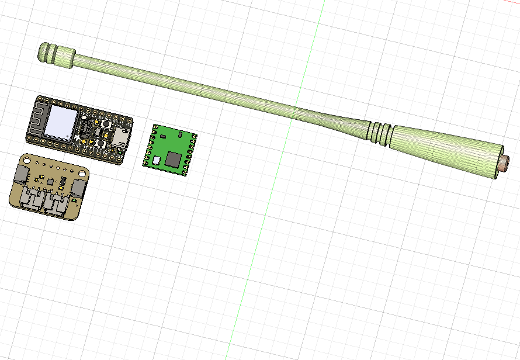
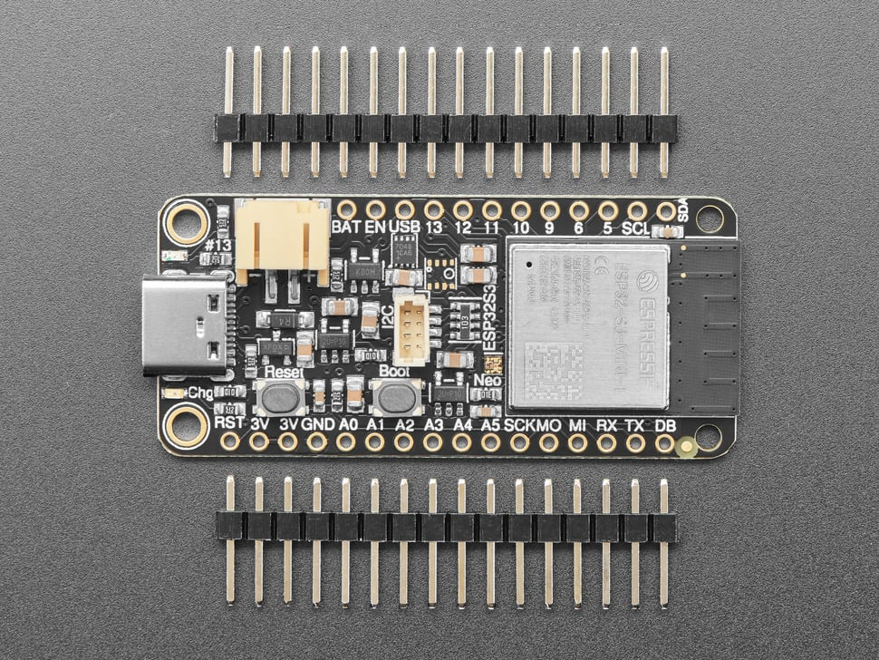
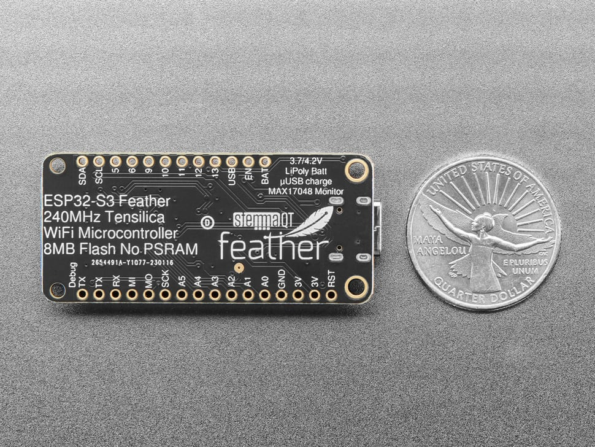

# Truffula Node PCB

## Design Overview

The Truffula Node PCB is a **custom design** combining:

- **Adafruit Feather ESP32-S3** (main MCU)
- **HopeRF RFM95W** (915MHz LoRa radio)
- **Adafruit MAX17048** (battery fuel gauge)
- **AP22802** (load switch for power gating)

## Key Features

- **Low power**: Deep sleep support, power gating for RFM95W
- **Battery monitoring**: MAX17048 for accurate fuel gauge in deep sleep
- **Range optimization**: Direct antenna connection (5dBi recommended, 10dBi optional)
- **Compact**: 58×23×9mm footprint
- **Magnetic mount**: N42 magnet pocket in bottom case

## PCB Design Files

- **Eagle PCB**: `pcb/Adafruit ESP32-S3 8MB No PSRAM.brd` (current design)
- **Eagle Schematic**: `pcb/Adafruit ESP32-S3 8MB No PSRAM.sch` (current design)
- **Pinout Reference**: `pcb/Adafruit Feather ESP32-S3 Pinout.pdf`
- **KiCad project**: `truffula-node.kicad_pcb` (to be created)
- **Gerber files**: `gerbers/` (to be generated)

## CAD Design Process

The PCB design is currently in progress using Eagle CAD. Design images and progress photos are available in the repository.

### Design Images

*Current PCB layout showing component placement*

*Electronics assembly view*

*Adafruit Feather ESP32-S3 with headers*

*Adafruit Feather ESP32-S3 reference*

### Current Status

✅ **Completed**:
- PCB layout design (Eagle)
- Component placement
- Schematic design
- Documentation and guides

🚧 **In Progress**:
- Trace routing optimization
- Design rule checking (DRC)
- Gerber file generation

❌ **Still Needed**:
- **Mounting hardware**: Standoffs, screws, mounting points for case integration
- Case design integration with PCB mounting points
- Final PCB review and manufacturing preparation

## Component Placement

For detailed placement instructions, see [PLACEMENT_GUIDE.md](PLACEMENT_GUIDE.md).

**Quick Summary**:
1. **Feather ESP32-S3**: Center of board (plugs into pin headers JP1, JP3)
2. **RFM95W**: Left side, soldered to carrier PCB (NOT plugged into ESP32-S3)
3. **MAX17048**: Right side, I2C connection to Feather
4. **AP22802**: Power gate between 3.3V rail and RFM95W
5. **WS2812B**: Status LED, visible through case
6. **JST PH**: Battery connector, bottom edge

**Important**: RFM95W and ESP32-S3 are **separate modules** connected via **SPI traces** on the carrier PCB. They do NOT plug directly into each other.

## Manufacturing Notes

- **PCB thickness**: 1.6mm (standard)
- **Copper layers**: 2-layer (top + bottom)
- **Finish**: HASL or ENIG (ENIG recommended)
- **Solder mask**: Green (standard)
- **Silkscreen**: Component labels, polarity marks

## Connectors

For a detailed breakdown of which connectors are required vs optional, see [CONNECTOR_GUIDE.md](CONNECTOR_GUIDE.md).

**Quick Summary**:
- ✅ **Required**: Pin headers for Feather ESP32-S3 (JP1, JP3), JST PH battery connector (X1)
- ❌ **Optional/Redundant**: USB connectors on carrier board (Feather already has USB-C)

## Assembly

See [build-journey/02_solder_antenna.md](build-journey/02_solder_antenna.md) for step-by-step assembly instructions.

## Documentation

- [pcb/](pcb/) — PCB design files, guides, and CAD documentation
- [docs/](docs/) — Additional documentation (BOM, guides, etc.)
- [build-journey/](build-journey/) — Step-by-step assembly guide
- [firmware/](firmware/) — Arduino mesh relay code
- [enclosures/](enclosures/) — 3D print files

---

*Built on KaliAssistant's Fox-Jack foundation — see `CREDITS.md`*

